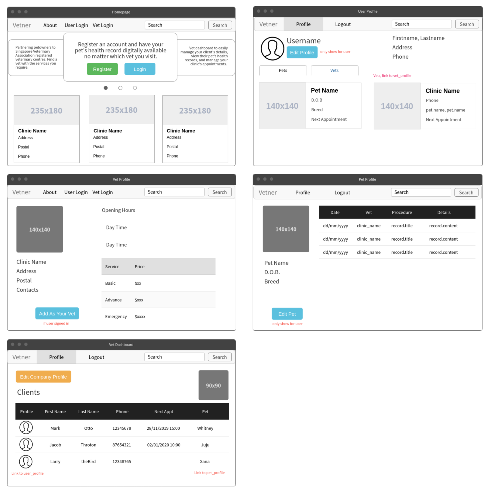
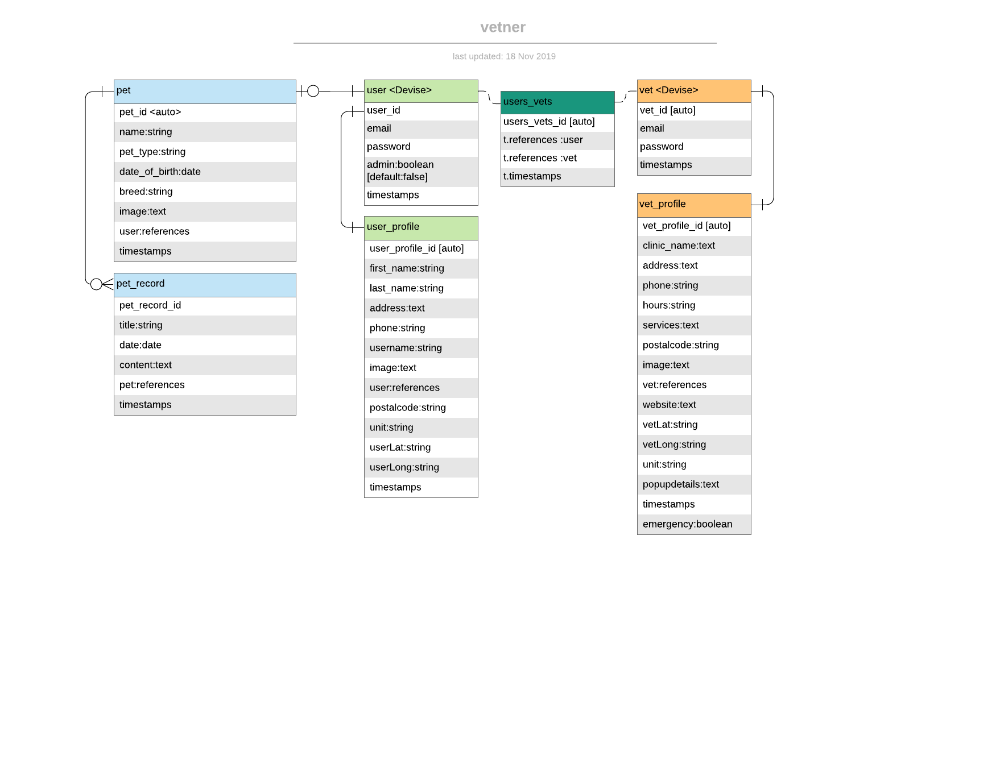

# VETNER
## Technologies used
* Ruby, Rails, Javascript, HTML, SCSS, Bootstrap, PostgreSQL
### APIS
* One Map: https://docs.onemap.sg/
* Mapbox: https://docs.mapbox.com/
* Leaflet: https://leafletjs.com/reference-1.6.0.html
## Installation instructions
1. Clone the repository
```
git clone https://github.com/reshinto/vetner.git
```
2. Install all dependencies
```
bundle i
```
3. Create Database
```
rails db:create
rails db:migrate
```
4. Get API key for Mapbox and One Map
5. Create .env file
```
touch .env
```
6. Edit .env file and input the required information without quotes
```
GMAIL_USERNAME = example@email.com
GMAIL_PASSWORD = somepassword
ONEMAPTOKEN = someApiKey
MAPBOXTOKEN = someApiKey
```
7. (optional) Run seeds to populate sample data
```
rails db:seed
```
## Wireframes

## Entity Relationship Diagram (ERD)

